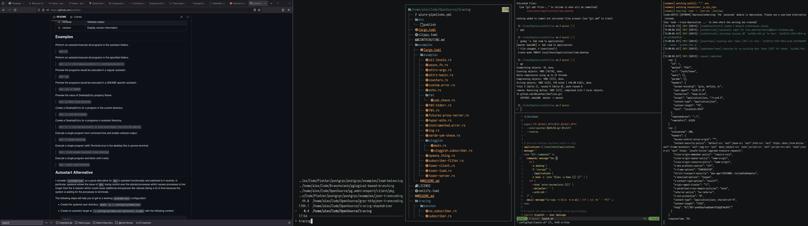

# `dotfiles`

`NAlexPear`'s collection of dotfiles for daily use.

## Usage

To symlink these files to the proper locations, use `link.sh`.

Linux distros running `wayland`-based compositors are assumed for most dependencies, and no dependency resolution is attempted. You will probably want to install the following for the best experience:

`bat`
`diffsitter`
`eza`
`erdtree`
`fd`
`fzf`
`hyprland`
`kitty`
`nvim`
`qt6-wayland`
`ttf-iosevka`
`ttf-iosevka-term`
`uni`
`wl-clipboard`
`xdg-desktop-portal-hyprland`
`xdg-desktop-portal-gtk`
`zoxide`

## Screenshots

Window management is done through Hyprland on an Ultrawide monitor.

